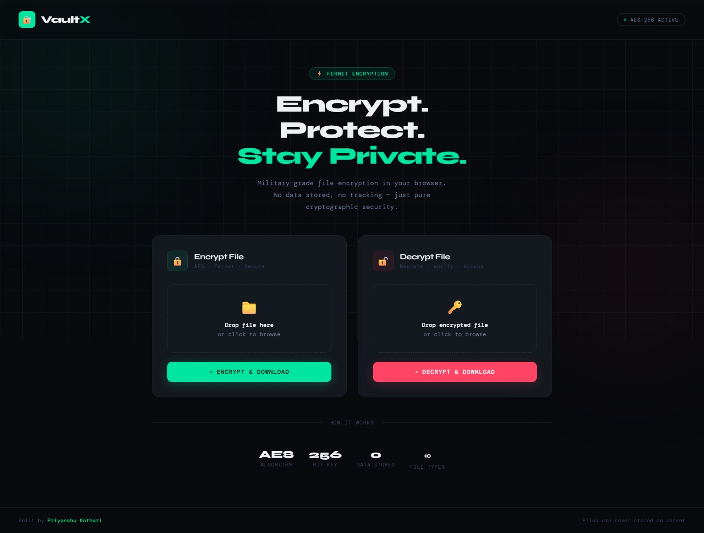
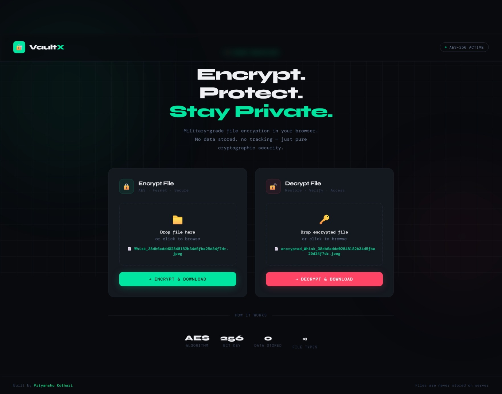
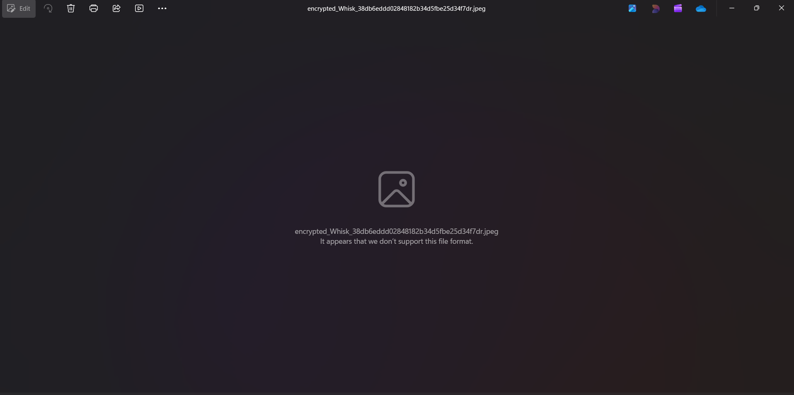

# VaultX — Secure File Sharing Web App 🔒

A professional web application for secure file encryption and decryption using AES-256, built with Python, Flask, and Cryptography — deployed live on Render.

[🔗 Live Demo](https://secure-file-web-2.onrender.com)

---

## 🌟 Features

- ✅ Upload any file and encrypt it with AES-256 (Fernet)
- ✅ Decrypt previously encrypted files instantly
- ✅ Drag & drop file upload support
- ✅ Clean, dark, responsive UI
- ✅ No files stored on server — full privacy
- ✅ Built with Python, Flask, and Cryptography

---

## 🚀 How to Run Locally

**1. Clone the repository**
```bash
git clone https://github.com/PriyanshuKothari/VaultX.git
cd secure-file-web
```

**2. Install dependencies**
```bash
pip install -r requirements.txt
```

**3. Generate your encryption key** *(run once only)*
```bash
python generate_key.py
```
> ⚠️ Keep `secret.key` safe — never share or commit it to GitHub!

**4. Start the server**
```bash
python app.py
```

**5. Open in browser**
```
http://127.0.0.1:5000
```

---

## 🗂️ Project Structure

```
secure-file-web/
├── app.py              # Main Flask application
├── database.py         # Database models
├── generate_key.py     # Key generation script
├── requirements.txt    # Python dependencies
├── render.yaml         # Render deployment config
├── .gitignore
├── templates/
│   └── index.html      # Frontend UI
└── screenshots/
```

---

## 📸 Screenshots

### 🔹 Main Page


### 🔹 Working Page


### 🔹 Success Message



---

## 🛠️ Tech Stack

| Layer | Technology |
|---|---|
| Backend | Python, Flask |
| Encryption | Cryptography (Fernet / AES-256) |
| Database | PostgreSQL (via Render) |
| Deployment | Render |
| Frontend | HTML, CSS, JavaScript |

---

## 👨‍💻 Author

**Priyanshu Kothari**